# ⚡ NanoTrade Backend — High-Performance Crypto Matching Engine & Trading Core

<p align="center">
  
  
  
  
  
  
  
  
  
</p>

---

## 📌 Executive Overview

**NanoTrade Backend** is the low-latency execution and real-time data engine powering the NanoTrade crypto paper-trading platform. It bridges ultra-fast native systems programming with modern distributed web architecture:

* **Core Execution:** Custom **C++17 matching engine** implementing strict Price-Time Priority (FIFO) order matching with zero garbage collection pauses.
* **Zero-Copy Interop:** Bound directly into Python as an in-process native extension using **Pybind11**.
* **Durable Message Ingestion:** **Redis Streams** with Consumer Groups for guaranteed, at-least-once order processing.
* **Concurrency Control:** Granular distributed locking on user balances preventing double-spending.
* **ACID Settlement:** Idempotent **PostgreSQL stored procedures (RPC)** guaranteeing atomic balance and portfolio updates.
* **Market Microstructure Simulation:** Autonomous **Celery workers** deploying 5 algorithmic bot archetypes to maintain realistic order book depth around live Binance reference prices converted to Indian Rupees (INR).
* **Real-Time Data Distribution:** High-throughput **Redis Pub/Sub** broadcasting live depth, trades, and candles to clients via **WebSockets**.

---

## 🏗️ End-to-End System Architecture

```mermaid
flowchart TB
    subgraph External ["External Feeds"]
        BINANCE["Binance WebSocket\n(btcusdt@ticker / trade / kline)"]
    end

    subgraph Client ["Frontend Client"]
        WEB["React 18 Terminal\n(Zerodha Style)"]
    end

    subgraph Gateway ["FastAPI Gateway (:8000)"]
        AUTH["Supabase JWT Auth & Rate Limiter"]
        ORDERS_API["POST /orders"]
        PORTFOLIO_API["GET /portfolio & /orders/history"]
        WS_GATEWAY["WebSocket Server (/ws/market)"]
    end

    subgraph RedisBroker ["Redis 7 Infrastructure"]
        LOCK["Distributed Locks\n(lock:user:{id}:{asset})"]
        STREAM["Redis Stream\n(engine:orders_stream)"]
        PUBSUB["Redis Pub/Sub Channels\n(trade, orderbook, market:price)"]
    end

    subgraph EngineWorker ["Execution Engine Worker"]
        DAEMON["engine_daemon.py\n(Asyncio Consumer)"]
        PYBIND["Pybind11 C++ Extension\n(_nanotrade_ext)"]
        CPP_ENGINE["C++ Matching Engine\n(OrderBook: std::map + std::queue)"]
    end

    subgraph Persistence ["Persistence Layer (Supabase PostgreSQL)"]
        DB_ORDERS["orders Table"]
        DB_PROFILES["profiles Table (Balances)"]
        DB_PORTFOLIOS["portfolios Table (Holdings)"]
        DB_TRADES["trades Table (Executions)"]
        RPC["Atomic RPC: settle_trade_atomic"]
    end

    subgraph SimulatorWorker ["Market Simulator (Celery)"]
        CELERY["Celery Worker (tasks.py)"]
        BOTS["5 Bot Archetypes\n(Noise, Momentum, Mean Reversion, Whale, MM)"]
    end

    %% Wiring
    BINANCE -->|Live Prices| Gateway
    WEB -->|1. Submit Limit/Market Order| ORDERS_API
    ORDERS_API --> AUTH
    ORDERS_API -->|2. Acquire Lock| LOCK
    ORDERS_API -->|3. Check Margin Liabilities| DB_PROFILES
    ORDERS_API -->|4. Insert Status=QUEUED| DB_ORDERS
    ORDERS_API -->|5. XADD Order| STREAM
    ORDERS_API -->|Release Lock| LOCK

    STREAM -->|6. XREADGROUP| DAEMON
    DAEMON -->|7. Update Status=PROCESSING| DB_ORDERS
    DAEMON -->|8. Process via C++| PYBIND --> CPP_ENGINE
    CPP_ENGINE -->|9. Matched Trades & Residuals| DAEMON

    DAEMON -->|10. Execute Atomic Settlement| RPC
    RPC --> DB_PROFILES
    RPC --> DB_PORTFOLIOS
    RPC --> DB_TRADES
    DAEMON -->|11. Update Order Status (FILLED/PARTIAL)| DB_ORDERS

    DAEMON -->|12. Publish Trades & Depth| PUBSUB
    PUBSUB --> WS_GATEWAY
    WS_GATEWAY -->|13. Real-Time Push| WEB

    CELERY --> BOTS
    BOTS -->|Signed Orders (X-Simulator-Secret)| ORDERS_API
```

---

## 🔄 The Complete Order Lifecycle (From Step 1 to Last Step)

Here is exactly what happens under the hood when a trader places an order:

```mermaid
sequenceDiagram
    autonumber
    actor User as Trader (Frontend)
    participant API as FastAPI Gateway
    participant Lock as Redis Lock
    participant DB as PostgreSQL DB
    participant Stream as Redis Stream
    participant Daemon as Engine Daemon
    participant CPP as C++ Matching Engine
    participant PubSub as Redis Pub/Sub
    participant WS as WebSocket Hub

    User->>API: POST /orders (BUY 0.05 BTC @ ₹8,500,000) with JWT
    API->>API: Validate Token & Round Decimals (Price: 2dp, Qty: 6dp)
    API->>Lock: Acquire Redis Lock (lock:user:{id}:INR)
    API->>DB: Query Balance & Liabilities (Active buy orders)
    alt Insufficient Balance
        API-->>User: 400 Bad Request ("Insufficient Funds")
    else Balance OK
        API->>DB: INSERT into orders (status = 'QUEUED')
        API->>Stream: XADD engine:orders_stream (order payload)
        API->>Lock: Release Redis Lock
        API-->>User: 200 OK (order_id, status: 'QUEUED')
    end

    Stream->>Daemon: XREADGROUP delivers order to worker
    Daemon->>DB: UPDATE orders SET status = 'PROCESSING'
    Daemon->>CPP: process_order(Order) via Pybind11

    rect rgb(20, 30, 45)
        Note over CPP: C++ scans opposite book side (Asks)<br/>Matches using Price-Time Priority (FIFO)<br/>Generates Trade records, updates internal book
    end

    CPP-->>Daemon: Returns ProcessResult (trades, remaining_qty, fillStatus)

    loop For each executed trade
        Daemon->>DB: CALL settle_trade_atomic(trade_id, buyer, seller, price, qty)
        Note over DB: Atomically debits buyer INR, credits seller INR,<br/>updates buyer portfolio rolling avg price,<br/>deducts seller BTC holdings (Idempotent).
        Daemon->>PubSub: PUBLISH trade channel
    end

    Daemon->>DB: UPDATE orders SET status = fillStatus, quantity = remaining_qty
    Daemon->>Stream: XACK message (Consumer group acknowledgement)
    Daemon->>PubSub: PUBLISH orderbook channel (new depth)
    PubSub->>WS: Broadcast message received
    WS-->>User: Real-time update (depth changes, portfolio updates, order filled)
```



---

## 🧠 Core System Modules

### 1. C++ Matching Engine (`src/engine/` & `include/engine/`)
* **Strict Price-Time Priority:**
  * Bids maintained in `std::map<double, std::queue<Order>, std::greater<double>>` (Highest price first).
  * Asks maintained in `std::map<double, std::queue<Order>>` (Lowest price first).
  * Inside each price level, orders are stored in a standard FIFO `std::queue<Order>`.
* **Zero Floating-Point Drift:** Order quantities are converted into 6-decimal fixed-point integers (`qty * 1,000,000`) before entering C++, eliminating IEEE 754 precision inaccuracies.
* **Thread Safety:** Enclosed in `std::mutex` with RAII `std::lock_guard`.
* **Fast Serialization:** Uses `nlohmann::json` for order book depth serialization without runtime allocation bottlenecks.

### 2. Pybind11 Native Extension (`src/bindings.cpp`)
* Direct C++ compilation to a native Python module (`_nanotrade_ext`).
* Exposes C++ classes (`Order`, `Trade`, `MatchingEngine`, `OrderType`, `ProcessResult`) directly to the Python runtime, removing any inter-process communication (IPC) or serialization overhead.

### 3. FastAPI Gateway (`python/app/api/`)
* **Asynchronous Endpoints:** High-concurrency async request handlers.
* **Supabase JWT Authentication:** Decodes and verifies client access tokens cryptographically.
* **Granular Distributed Locks:** Uses `redis.asyncio.lock.Lock` scoped per user and asset (`lock:user:{id}:{asset}`) to prevent concurrent double-spending while allowing independent operations across different users.
* **Pre-Execution Margin Validation:** Accurately accounts for funds already locked in pending `QUEUED`, `PROCESSING`, and `PARTIALLY_FILLED` orders.

### 4. Engine Daemon & Crash Recovery (`python/app/workers/engine_daemon.py`)
* **Redis Streams Consumer Group:** Listens to `engine:orders_stream` with durable acknowledgments (`XACK`).
* **Self-Healing State Hydration (`hydrate_engine()`):**
  * When restarted, it reads all active `NEW` and `PARTIALLY_FILLED` orders from the PostgreSQL database in chronological order and replays them into the C++ engine.
  * Reverts any zombie orders stuck in `PROCESSING` back to `QUEUED`.
  * Recovers unacknowledged messages idle for over 10 seconds via `XAUTOCLAIM`.
* **Dead-Letter Queue (DLQ):** Retries transient failures up to 3 times before moving corrupted orders to `engine:dead_letter_queue` and setting order status to `FAILED`.

### 5. PostgreSQL Atomic Trade Settlement (`supabase/supabase_schema.sql`)
* Implements the `settle_trade_atomic` stored procedure:
  * **Idempotency:** Inserts trade record with `ON CONFLICT (id) DO NOTHING`. If already processed, it exits immediately, preventing double balance debits.
  * **Buyer Wallet:** Deducts `price * quantity` INR.
  * **Buyer Portfolio:** Upserts BTC holding, calculating the exact volume-weighted average price:
    $$\text{AvgPrice}_{\text{new}} = \frac{(\text{Qty}_{\text{old}} \times \text{AvgPrice}_{\text{old}}) + (\text{Qty}_{\text{trade}} \times \text{Price}_{\text{trade}})}{\text{Qty}_{\text{old}} + \text{Qty}_{\text{trade}}}$$
  * **Seller Wallet:** Credits `price * quantity` INR.
  * **Seller Portfolio:** Decrements BTC holding (deletes row if zero).

### 6. Algorithmic Market Simulator (`python/app/services/simulator_service.py`)
Maintains realistic order book depth by generating synthetic order flow around live Binance BTC/USDT prices converted to INR:
* **Noise Traders:** Random retail buys/sells within $\pm 0.02\% - 0.2\%$ spread.
* **Momentum Traders:** Trend followers placing tighter spread orders ($\pm 0.01\% - 0.1\%$).
* **Mean Reversion Traders:** Places limit orders inside the spread betting on price snapping back.
* **Whales:** Rare 5% probability orders of 1.5 to 5.0 BTC causing order book sweeps.
* **Market Makers:** Multi-tiered laddered bids and asks around the market midpoint.
* **Security:** Internal simulator orders authenticate via `X-Simulator-Secret` header.

### 7. Real-Time Binance Data Pipeline (`python/app/market_data.py`)
* Connects to Binance WebSocket multiplexing:
  * `btcusdt@ticker` (Live reference price)
  * `btcusdt@trade` (Market trades)
  * `btcusdt@kline_1m` (1-minute candlestick OHLCV)
* Converts USD prices to INR using a live exchange rate stored in Redis.
* Broadcasts normalized events to Redis Pub/Sub channels (`market:price`, `market:trades`, `market:kline`).

---

## 📂 Backend Repository Directory Structure

```text
NanoTrade-backend/
├── CMakeLists.txt              # C++17 build definition & Pybind11 compilation config
├── Dockerfile                  # Multi-stage container build (C++ compiler + Python runtime)
├── docker-compose.yml          # Orchestration for API, Engine Daemon, Celery & Redis 7
├── include/                    # C++ Header files
│   ├── compat/                 # Compatibility headers (optional types)
│   ├── engine/                 # MatchingEngine.h, OrderBook.h
│   ├── models/                 # Order.h, Trade.h
│   └── utils/                  # Logger.h, Time.h, SPSC queue, memory arena
├── python/                     # Python Application Codebase
│   └── app/
│       ├── api/                # FastAPI routes & dependency injection
│       │   ├── deps.py         # Auth, Redis, Rate limiter dependencies
│       │   └── routes/         # orders.py, market.py, portfolio.py, auth.py
│       ├── core/               # config.py, database.py, logger.py, security.py
│       ├── market_data.py      # Binance WebSocket listener & INR currency converter
│       ├── services/           # Business logic
│       │   ├── order_service.py      # Distributed locking & stream submission
│       │   ├── portfolio_service.py  # Margin validation & PnL calculation
│       │   ├── simulator_service.py  # 5 Bot personalities & synthetic liquidity
│       │   └── strategy_service.py   # Strategy backtesting & execution logic
│       ├── websocket/          # manager.py (Pub/Sub listener & client broadcaster)
│       └── workers/            # Background daemons
│           ├── celery_app.py   # Celery worker configuration
│           ├── engine_daemon.py# Redis Stream consumer & C++ engine executor
│           └── tasks.py        # Periodic simulation tasks
├── src/                        # C++ Source Implementations
│   ├── bindings.cpp            # Pybind11 module bindings (_nanotrade_ext)
│   ├── engine/                 # MatchingEngine.cpp, OrderBook.cpp
│   └── test_harness.cpp        # Standalone C++ engine performance benchmarking
└── supabase/                   # Database schema & migrations
    └── supabase_schema.sql     # Tables, RLS policies & settle_trade_atomic RPC
```

---

## ⚙️ Environment Variables

Create a `.env` file in the root directory (copy from `.env.example`):

```env
# Application
PROJECT_NAME="NanoTrade Backend"
API_V1_STR="/api/v1"
LOG_LEVEL="INFO"

# Redis
REDIS_URL="redis://localhost:6379/0"

# Supabase (PostgreSQL & Auth)
SUPABASE_URL="https://your-project.supabase.co"
SUPABASE_KEY="your-anon-or-service-role-key"
SUPABASE_JWT_SECRET="your-supabase-jwt-secret"

# Market Simulator
SIMULATOR_SECRET="your-cryptographic-simulator-secret"
USD_INR_RATE=90.0
```

---

## 🚀 Setup & Execution Guide

### Option 1: Run with Docker Compose (Recommended)

NanoTrade includes a production-grade multi-stage Docker build that compiles the C++ matching engine and sets up the Python environment automatically:

```bash
# 1. Clone the repository
git clone https://github.com/your-username/nanotrade-backend.git
cd nanotrade-backend

# 2. Configure environment
cp .env.example .env
# Edit .env with your Supabase credentials

# 3. Build and launch all services
docker-compose up --build
```

**Services launched:**
* **Redis 7:** `localhost:6379`
* **FastAPI Server:** `http://localhost:8000` (Swagger UI at `/docs`)
* **Engine Daemon:** Continuously consumes orders from Redis Streams
* **Celery Worker:** Generates automated synthetic market depth

---

### Option 2: Local Native Build (For Development)

#### 1. Compile the C++ Engine Extension
Make sure you have CMake 3.10+ and a C++17 compiler (GCC, Clang, or MSVC) installed:

```bash
mkdir build
cd build
cmake .. -DCMAKE_BUILD_TYPE=Release
cmake --build . --config Release
cd ..
```
*This generates `_nanotrade_ext.pyd` (Windows) or `_nanotrade_ext.so` (Linux/macOS) in the `build/` directory.*

#### 2. Install Python Dependencies
```bash
python -m venv venv
source venv/bin/activate  # Or on Windows: venv\Scripts\activate
pip install -r python/requirements.txt
```

#### 3. Start Redis Server
Ensure local Redis is running on port `6379`:
```bash
redis-server
```

#### 4. Run Services in Parallel
Open 3 terminal windows:
```bash
# Terminal 1: API Server & WebSocket Hub
uvicorn app.main:app --app-dir python --reload --port 8000

# Terminal 2: Engine Daemon
python -m app.workers.engine_daemon

# Terminal 3: Market Simulator (Celery)
celery -A app.workers.celery_app worker --app-dir python --loglevel=info
```

---

## 🧪 Testing & Verification

Run automated integration tests verifying order submission, rate limiting, and fund validation:

```bash
python test_public_api.py
```

To run C++ engine unit benchmarks independently:
```bash
./build/TestHarness
```

---

## 🔒 Security & ACID Guarantees

* **JWT Verification:** All authenticated routes validate the cryptographic signature and expiration of Supabase JWTs.
* **Row-Level Security (RLS):** Supabase PostgreSQL tables strictly enforce tenant isolation (`auth.uid() = user_id`).
* **Direct Database Write Protection:** Direct client `INSERT`/`UPDATE` operations on orders and balances are blocked via RLS policies; all mutations must flow through the backend matching pipeline.
* **Zero Race Conditions:** Distributed Redis locking prevents parallel double-spending across concurrent requests.
